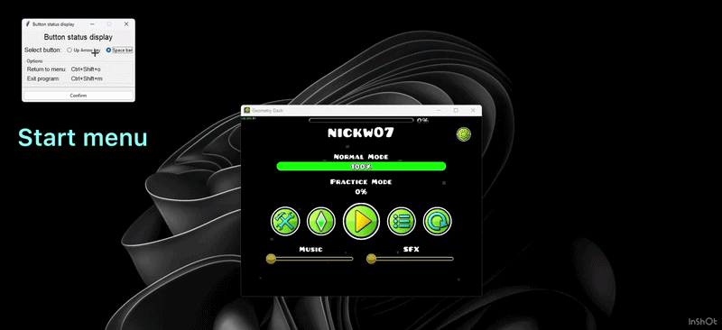
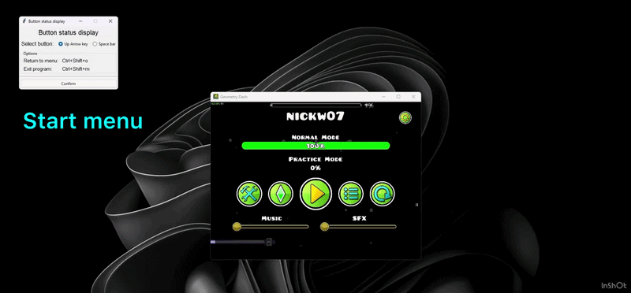

# Key Visualizer (Python & Tkinter)

Lightweight desktop overlay that visualizes keyboard input in real time.

The program allows you to:

- Display key press status
- Switch between monitored keys (Space / Arrow Up)
- Always-on-top overlay
- Keyboard shortcuts for mode switching and clean exit
- Single Tkinter window reused across all modes

<br>

## 🖼️ | Preview

### 1. Arrow Up indicator


### 2. Space bar indicator


### 2. Hotkeys


<br>

## 🎮 | Controls
| Action         | Shortcut         |
|----------------|------------------|
| Return to menu | Ctrl + Shift + O |
| Exit program   | Ctrl + Shift + M |

<br>

## 🧠 | Concepts used
- Single-root Tkinter architecture
- Dynamic UI rebuilding (menu ↔ overlay)
- Overlay window configuration (frameless, transparent, topmost)
- Decoupled overlay lifecycle using stop callbacks
- Global keyboard event handling

<br>

## 🛠️ | Technologies & Libraries
- `tkinter` – GUI framework (GUI & Canvas)
- `keyboard` - global hotkeys & key state detection

<br>

## 📁 | Project Structure
- `overlays/` - Overlay design & logic (space and arrow up key)
- `ui/` - UI setup for the main window
- `main.py` - Application entry point & mode control

<br>

## 🧑‍⚖️ | Credits
The GIF was made using [ezgif](https://ezgif.com/maker)

<br>

## 🚀 | Installation

1. Clone the repository
```
git clone https://github.com/nickw07/key-visualizer-tkinter.git
cd key-visualizer-tkinter
```

2. Recommended: Create a virtual environment and activate it *(Example shows activation in CMD)*
```
python -m venv .venv
```
```
.venv\Scripts\activate.bat
```

3. Install required packages
```
pip install -r requirements.txt
```

4. Run the application (`main.py` in the project folder)
```
python main.py
```

<br>

## 📒 | Notes
- The application was developed using Python 3.x and PyCharm
- It is designed specifically for Windows systems
- ChatGPT was used as a development assistant to refine the overlay lifecycle and optimize performance-critical update loops.

<br>

## 🐛 | Bugs
- Feel free to report any bugs